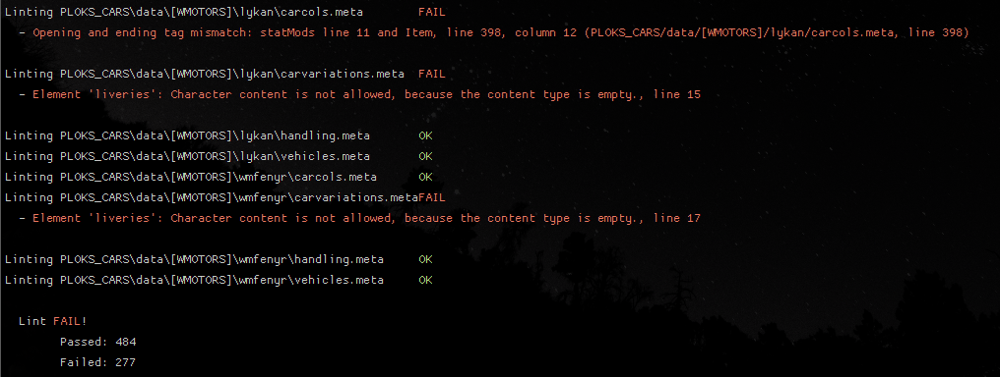

# rage-lint  
  
Lint RAGE (only GTA5 at the moment) meta/XML files for validity based off of the [GTA5.xsd](https://github.com/GoatG33k/gta5-xsd/blob/master/GTA5.xsd) generated from game code.  
  
This script accepts a series of blobs, and validates all files against GTA5.xsd, allowing to check your metafiles   
against Rockstar's own definitions.



> NOTE: This software is EXPERIMENTAL, there are likely XSD generation issues laying around

## Usage
A **rage-lint.exe** file is provided in the [releases tab](https://github.com/GoatG33k/rage-lint/releases).

## Compiling
To use this script, first install the dependencies with `pip install -r requirements.txt`, then call it like so:
```
python3 rage-lint.py **/*.meta
```

## Development
To contribute to this script, you will need Python 3.x.
* Clone the repository
* `pip install -r requirements.txt`
* `python3 rage-lint.py`

## License
This software is licensed under the MIT license.